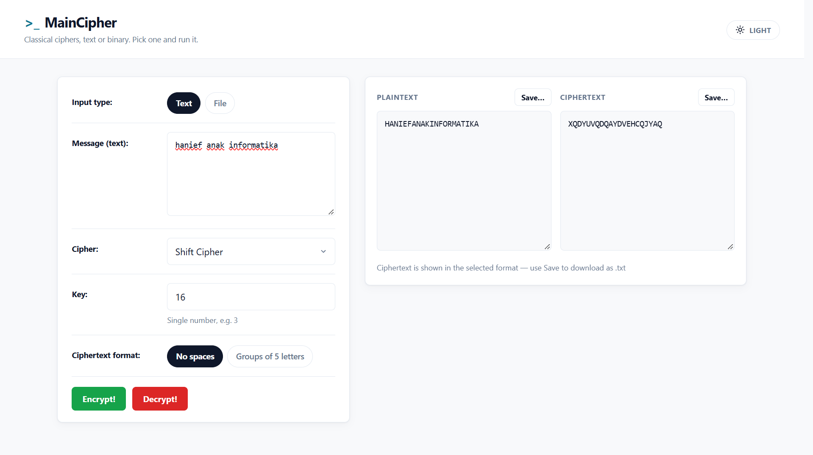
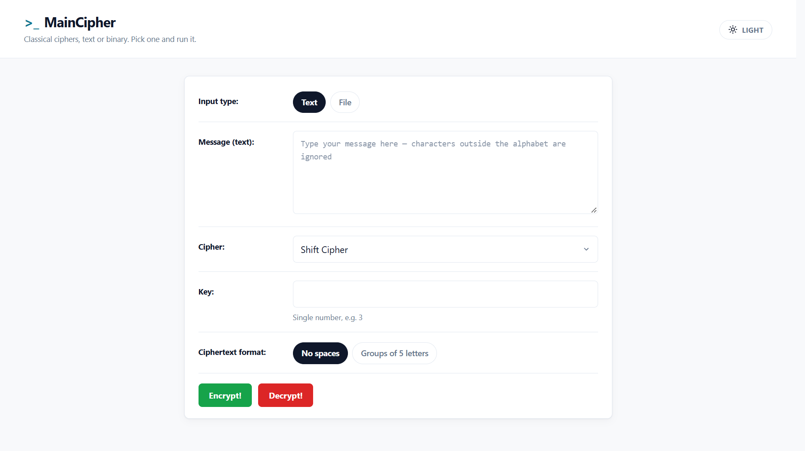
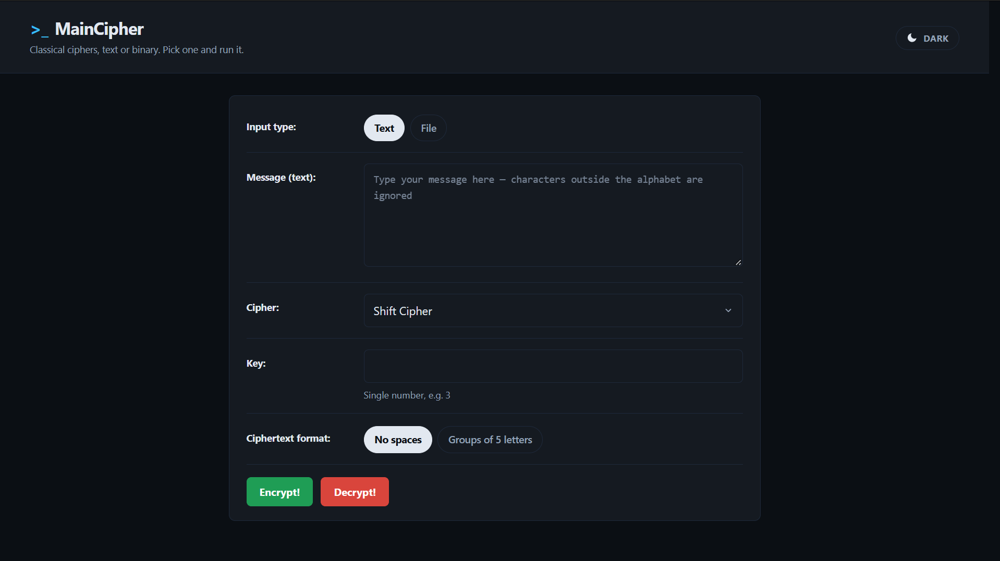

# >_ MainCipher — Aplikasi Kriptografi Klasik Online (GUI Web)

Aplikasi web untuk enkripsi dan dekripsi menggunakan 8 cipher klasik. Memenuhi spesifikasi tugas mata kuliah Kriptografi.

**Kelompok 2 (PSDKU Informatika — Kriptografi, Semester Ganjil 2026/2027)**

| No | Nama | NIM |
|----|------|-----|
| 1 | Daffa Arkhan Aditama | L0324010 |
| 2 | Hanief Fahrel Wilianto | L0324016 |
| 3 | Muhammad Affan Nur Zhafariza | L0324022 |

Dibuat dengan **Python + Flask** (GUI berbasis web).

## Fitur Utama

1. **8 Cipher Klasik:**
   - **Shift Cipher** (Caesar, geser 1 angka)
   - **Substitution Cipher** (monoalfabet, tabel permutasi 26 huruf)
   - **Affine Cipher** ($C = (a \cdot P + b) \pmod m$)
   - **Vigenere Cipher** (kunci alfabet diulang)
   - **Playfair Cipher** (matriks $5 \times 5$, I/J digabung; khusus mode teks/alfabet)
   - **Hill Cipher** (matriks $n \times n$ per blok)
   - **Permutation Cipher** (permutasi $1 \dots m$ per blok)
   - **One-Time Pad (OTP)** (kunci dari file huruf acak sepanjang pesan)

2. **Dua Mode Input:**
   - **Mode Teks:** memproses alfabet A–Z. Karakter non-huruf diabaikan. Cipherteks dapat diformat *tanpa spasi* atau *kelompok 5 huruf*. Hill & Permutasi memakai padding ala PKCS#7 (jumlah padding ikut tersimpan) sehingga dekripsi mengembalikan plainteks persis, termasuk bila berakhiran huruf `X`. Playfair membuang kembali huruf pengisi `X` saat dekripsi.
   - **Mode File:** membaca dan mengenkripsi seluruh byte file sembarang (termasuk header file) dengan aritmetika modulo 256. Hasil disimpan sebagai `.dat` dengan metadata magic `PYCF` untuk pemulihan nama & ekstensi asli secara otomatis saat didekripsi. Playfair tidak tersedia untuk mode file (hanya alfabet).

3. **Fitur Tambahan:**
   - Pembangkit file kunci OTP acak dengan panjang yang bisa diatur (default 50.000 huruf)
   - **Mode Terang / Gelap (Light / Dark Theme)** — tombol di kanan atas untuk beralih tema. Pilihan tema diingat (disimpan di `localStorage`) dan otomatis mengikuti tema sistem saat pertama kali dibuka.
   - Verifikasi hasil otomatis saat mengetik
   - Simpan hasil plaintext / ciphertext ke file `.txt`

---

## Tampilan Program

### 1. Form input (tema Terang)



Antarmuka saat pertama dibuka: pilih jenis input (**Text** / **File**), tulis pesan, pilih cipher, isi kunci, lalu pilih format cipherteks (*No spaces* / *Groups of 5 letters*). Tombol **Encrypt!** (hijau) dan **Decrypt!** (merah) ada di bawah.

### 2. Hasil enkripsi (tema Terang)



Setelah menekan **Encrypt!**: panel kanan menampilkan **Plaintext** dan **Ciphertext** berdampingan. Contoh: pesan `hanief anak informatika` dengan **Shift Cipher** (kunci `16`) menghasilkan cipherteks `XQDYUVQDQAYDVEHCQJYAQ`. Tombol **Save…** untuk mengunduh hasil sebagai `.txt`.

### 3. Tema Gelap



Tombol tema di kanan atas mengganti tampilan ke **mode gelap** (label `DARK`). Berguna untuk demo di ruangan gelap dan menunjukkan UI yang responsif terhadap preferensi pengguna.

---

## Cara Menjalankan

1. **Install Dependensi:**
   ```bash
   pip install -r requirements.txt
   ```

2. **Jalankan Aplikasi:**
   ```bash
   python cipher_app.py
   ```
   Akses di browser: `http://127.0.0.1:5000`

   > **Port error?** Bila muncul `An attempt was made to access a socket in a way forbidden by its access permissions`, itu karena port 5000 dipakai/diblokir Windows (umumnya di-reserve Hyper-V/WSL). Aplikasi **otomatis pindah ke port bebas** berikutnya dan mencetak alamatnya di terminal (mis. `http://127.0.0.1:5001`). Untuk memilih port sendiri:
   > ```bash
   > python cipher_app.py 8000        # lewat argumen
   > set PORT=8000 && python cipher_app.py   # lewat environment (Windows)
   > ```

---

## Cara Menjalankan Tes

```bash
python -m pytest
```

---

## Struktur Proyek

```
├── ciphers.py          # Logika 8 cipher klasik (mod 26 & mod 256)
├── cipher_app.py       # Server Flask & route API (/api/text, /api/file, /api/genkey)
├── templates/
│   └── index.html      # Antarmuka web
├── static/
│   ├── style.css       # Styling responsif & tema terang/gelap
│   └── app.js          # Logika frontend & handler API
├── test_ciphers.py     # 45 unit test logika cipher (round-trip, vektor klasik)
├── test_app.py         # Integration test route & UI Flask (total 88 tes)
├── requirements.txt
└── README.md
```

---

## Status Spesifikasi Tugas (Bagian A)

| No | Spesifikasi | Berhasil | Keterangan |
|----|-------------|:--------:|------------|
| 1 | Shift Cipher | ✅ | Geser alfabet 1 angka (Caesar) |
| 2 | Substitution Cipher | ✅ | Tabel permutasi 26 huruf |
| 3 | Affine Cipher | ✅ | $C = (aP + b) \bmod m$, cek koprima |
| 4 | Vigenere Cipher | ✅ | Kunci alfabet diulang sepanjang pesan |
| 5 | Hill Cipher | ✅ | Matriks $n \times n$ + balikan modulo; padding PKCS-like |
| 6 | Permutation Cipher | ✅ | Permutasi $1 \dots m$ per blok; padding PKCS-like |
| 7 | One-Time Pad | ✅ | Kunci dari file huruf acak (≥ 50.000 huruf) |
| — | Playfair Cipher | ✅ | Matriks $5 \times 5$, I/J digabung (khusus mode teks) |

**Spesifikasi umum:**

| No | Spesifikasi | Berhasil | Keterangan |
|----|-------------|:--------:|------------|
| 1 | Terima pesan file / ketikan | ✅ | Radio *Input type: Text / File* |
| 2 | Hanya enkripsi huruf alfabet (Vigenere/Playfair/OTP) | ✅ | Karakter non-huruf dibuang |
| 3 | OTP kunci dari file huruf acak (banyak) | ✅ | Tombol *Generate* 50.000 huruf |
| 4 | Dekripsi mengembalikan plainteks semula | ✅ | Terverifikasi 88 tes otomatis |
| 5 | Tampil plainteks + cipherteks (tanpa spasi / 5-huruf) | ✅ | Radio *Ciphertext format* |
| 6 | Simpan cipherteks ke file | ✅ | Tombol *Save…* / mode file `.dat` |
| 7 | Kunci dari pengguna, panjang bebas | ✅ | Kolom *Key* |
| 8 | Enkripsi file: semua byte termasuk header | ✅ | Aritmetika modulo 256 |
| 9 | `.dat` menyimpan nama/ekstensi asli, dipulihkan saat dekripsi | ✅ | Magic `PYCF` + nama + panjang |
| 10 | Pustaka balikan modulo/matriks | ✅ | `pow(x, -1, m)` + implementasi sendiri |

## Catatan / Batasan

- **Playfair** hanya untuk mode teks (alfabet); mode file ditolak dengan pesan jelas.
- **Playfair** mengikuti aturan standar: huruf kembar disisipi `X`, panjang ganjil dipad `X`. Huruf `J` dipetakan ke `I`. Huruf pengisi dibuang kembali saat dekripsi (kecuali `X` asli di ujung yang ambigu).
- **Hill & Permutasi mode teks** memakai padding yang tersimpan di cipherteks, sehingga plainteks berakhiran `X` tidak ikut terpotong. Konsekuensinya cipherteks selalu kelipatan ukuran blok (mis. `ACT` menjadi `POHKAA`), bukan bug melainkan keputusan desain agar dekripsi deterministik.
- **Permutasi mode teks** dibatasi ukuran blok ≤ 26 karena padding menyimpan nilai 0–25. Untuk blok lebih besar, gunakan mode file (atau hill).
- **OTP** memerlukan kunci **sepanjang pesan**. Panjang kunci yang dibangkitkan bisa diatur lewat kolom *Key length* di UI (default 50.000). Untuk file besar (gambar/audio/video, ratusan KB–MB), naikkan panjang kunci agar tidak lebih pendek dari pesan.
- **File sangat besar** diproses byte-per-byte sehingga butuh waktu & memori; untuk demo gunakan file berukuran wajar.
- **Kunci tidak valid / kosong** selalu menghasilkan pesan error (HTTP 400), bukan crash server.
